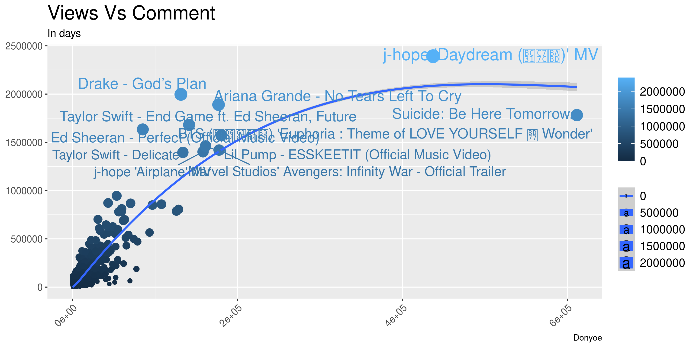

## Project 1 Bios 611
***
### Trending YouTube Video Statistics
***
### Proposal 
***
#### Introduction 
YouTube (the world-famous video sharing website) maintains a list of the top trending videos on the platform. According to Variety magazine, “To determine the year’s top-trending videos, YouTube uses a combination of factors including measuring users interactions (number of views, shares, comments and likes). Note that they’re not the most-viewed videos overall for the calendar year”. Top performers on the YouTube trending list are music videos (such as the famously virile “Gangam Style”), celebrity and/or reality TV performances, and the random dude-with-a-camera viral videos that YouTube is well-known for.

In this project, I will do some Exploratory Data Analysis on the dataset. This analysis will focus on answering the following questions:  
1) Is there correlation between the number of views and the number of comments over all trending videos?
2) Which Category has the most trending videos?
3) What are the most frequent category of trending videos? 
4) Which category has the most disliked videos? 
5) Whats the most frequent names in title, description, tags of trending videos?

Factors like the name of a video, the type of a video are significant elements of  a trending video. The answers from the quesitons above can help a youtuber to make the next trending video by finding the most popular types and names of the video. 

Further regression analysis could be done on the dataset, such as predicting the number of likes of each trending videos depends on several factor like comment disabled, number of views etc.

#### Datasets 
The datasets we undertake to analyze are publicly available on Kaggle and cover Trending YouTube Video Statistics. They can be downloaded.This repo will eventually contain an analysis of the Trending YouTube Video Statistics.This dataset is a daily record of the top trending YouTube videos.

This dataset includes several months (and counting) of data on daily trending YouTube videos. Data is included for the US, GB, DE, CA, and FR regions (USA, Great Britain, Germany, Canada, and France, respectively), with up to 200 listed trending videos per day. Data from RU, MX, KR, JP and IN regions (Russia, Mexico, South Korea, Japan and India respectively) are also included over the same time period.

Each region’s data is in a separate file. Data includes the video title, channel title, publish time, tags, views, likes and dislikes, description, and comment count.The data also includes a category_id field, which varies between regions.

The reason why I selected this dataset is I can study study how the preference of audiences from different countries varies. This interesting dataset can tell us plenty of infromation about the current scenario of country and what video contents/businesses are booming in that specific country. We can find lots of cool facts about youtube trending videos through this analysis.

source: https://www.kaggle.com/datasnaek/youtube-new

#### Preliminary Figures

In the correlation plot we can see there is a high correlation bewteen views and likes. Before looking at this graph I thought there would be a similiar correlation bewteen views and dislikes, but it looks like the correlation is a lot lower than between views and likes. The is also high correlation between likes and comment counts and dslikes and comment counts. 

The plot above proves our assumption is correct. There is a strong correlation between views and comments, then count of comments increase as likes of a video increases

### Usage
***
You'll need Docker and the ability to run Docker as your current user.

You'll need to build the container:

> docker build . -t project1-env

This Docker container is based on rocker/verse. To run rstudio server:

> docker run -v `pwd`:/home/rstudio -p 8787:8787\
  -e PASSWORD=mypassword -t project1-env

Then connect to the machine on port 8787.

If you are cool and you want to run this on the command line:

> docker run -v `pwd`:/home/rstudio -e PASSWORD=some_pw -it l6 sudo -H -u rstudio /bin/bash -c "cd ~/; R"

Or to run Bash:

> docker run -v `pwd`:/home/rstudio -e PASSWORD=some_pw -it l6 sudo -H -u rstudio /bin/bash -c "cd ~/; /bin/bash"

### Makefile
***
The Makefile is an excellent place to look to get a feel for the project.

To build the final project report for this project for example, enter Bash either via the above incantation or with Rstudio and say:

> make Report.pdf