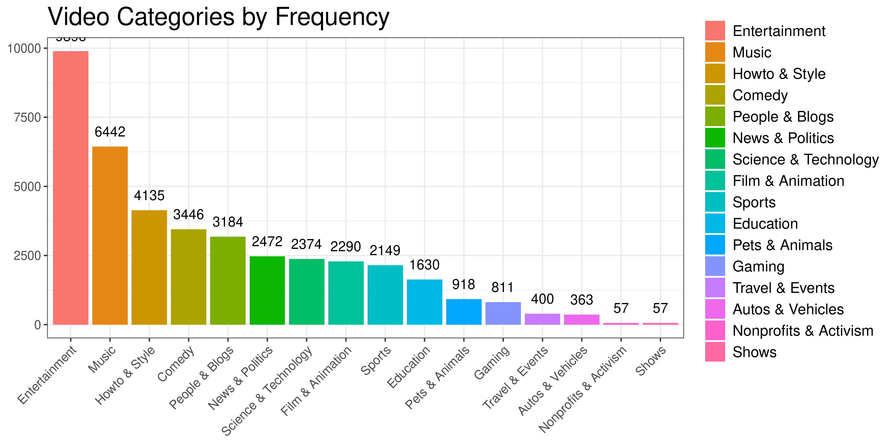
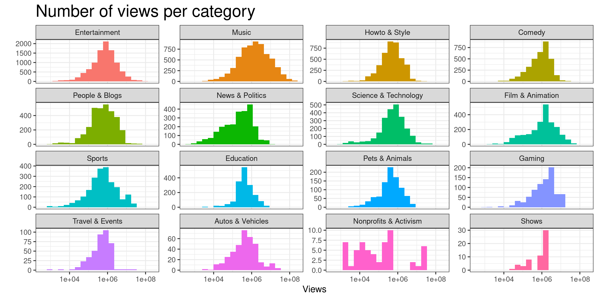
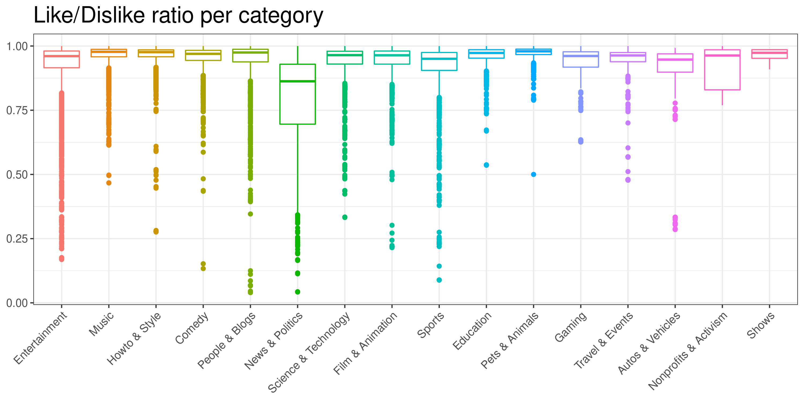
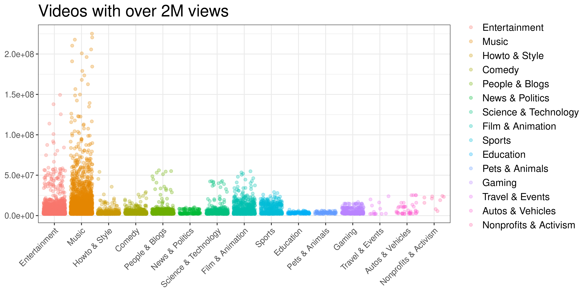
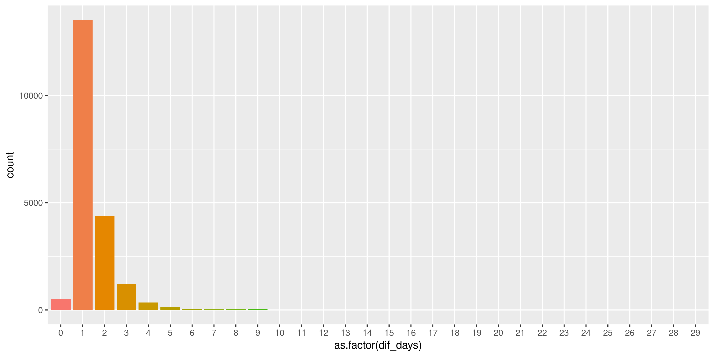

---
output:
  pdf_document: default
  html_document: default
---
## Project 1 Bios 611
***
### Trending YouTube Video Statistics
***
### Report 
***

In the analysis report, I will analyze youtube trending videos in the U.S only because this is the dataset that I am most familiar with. The purpose of this report is to give some suggestions to a new youtuber that wants to make the next trending video? : 
1) What category of the video should the youtuber make? 
2) What category of the video should the youtuber aviod? 
3) How should the youtuber name his title of the video? 

Looking at the Video Categories by frequency plot, we can see that Entertainment and music are the category that has the most trending videos. We can believe that there is a higher chance for music and entertainment become trending. Therefore, if a new youtuber wants to make a new trending video, he/she should probably make a video that is related to entertainment and music field.

However,another reason why entertainment has the most videos is that standard of the videos tagged as Entertainment is wider than the others,therefore, there might be more differences within this category than the others. In order to see the differnces inside each categories, let's draw the number of views per category. 

It is obvious that all categories show a normal distribution, The views at some categories, such as gaming,education, travel and event are stables, which means that views in these categories tend to watch/ subscribe to the same channels and don't change their perefences very often. We can conclude that the entertainment and music have high potential growth while education and gaming have low potential growth. This leads to a suggestion that a new youtuber should create a channel related to music or entertainment.   

Next, Let's look at Like/Dislike ratio of videos in each categories to get a picture of the videos with the best public reception. 

News & politics is the most disliked category based on the plot, followed by sports, auto/vehicles and entertainment. The wide ranges of boxplot in within these categories mean that the comments are controverted. In conclusion, Music seems to have the best public reception and if the youtuber is good at music-related skills. He/she should make a music video so that it can have the best change to become the next trending video, at the same time, they should aviod sports, auto/vehicles contents.

Every youtuber has a big dream that is having a video with over 2m views. Let's filter the dataset and only look at the videos with 2M views.

It is clear that Entertainment and Music have the largest potential to have the most views. One interesting obeservation from the plot is that a category having least videos with 2M views doesn't mean this category has the lowest performance. Categoty like Film&Animation perform really well but the number of video within this category is relatively. Therefore, if making entertainment or music video don't work for some youtubers, there're always other options. 

Looking at plot of the time passes between published and trending, It's interesting to see videos never trend in the same day it is published, this makes sense because a trending video requires time to be discovered before becoming a trending video. But I'm still suprised that most video trend only a day after they get released. 

###### still need to answer Whats the most frequent names in title, description, tags of trending videos? 

Possible uses for this dataset could include:

### Future development 
***
Futher analysis for this dataset could include:
1. Sentiment analysis in a variety of forms
2. Categorising YouTube videos based on their comments and statistics.
3. Training ML algorithms like RNNs to generate their own YouTube comments.
4. Analysing what factors affect how popular a YouTube video will be.
5. Statistical analysis over time.
6. Distribution of Attributes
7. Predict number of likes depends on several factors. 
Because this dataset was collected using the YouTube API, this dataset should be updated regularly. 

