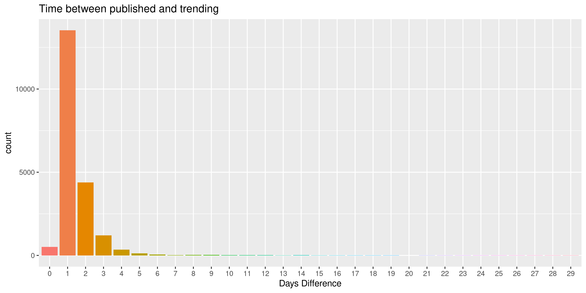

---
output:
  html_document: default
  pdf_document: default
---
## Project 3 Bios 611 with python
***
### Trending YouTube Video Statistics
***
### Report 
***

In the analysis report, I will analyze youtube trending videos in the U.S only because this is the dataset that I am most familiar with. The purpose of this report is to give some suggestions to a new youtuber that wants to make the next trending video: 
1) What category of the video should the youtuber make? 
2) What category of the video should the youtuber avoid? 
3) What kind of video have the best public reception?
4) How to make the next trending video with 2M views?
5) How long does it take for videos become trending after they are published? 


```{r,echo=FALSE}
readRDS("images/VideoCategories_fre.rds")
```
Looking at the Video Categories by frequency plot, we can see that Entertainment and music are the category that has the most trending videos. We can believe that there is a higher chance for music and entertainment become trending. Therefore, if a new youtuber wants to make a new trending video, he/she should probably make a video that is related to entertainment and music field.


However,another reason why entertainment has the most videos is that standard of the videos tagged as Entertainment is wider than the others,therefore, there might be more differences within this category than the others. In order to see the differnces inside each categories, let's draw the number of views per category. 


```{r,echo=FALSE}
readRDS("images/Num_views.rds")
```

It is obvious that all categories show a normal distribution, The views at some categories, such as gaming,education, travel and event are stables, which means that views in these categories tend to watch/ subscribe to the same channels and don't change their perefences very often. We can conclude that the entertainment and music have high potential growth while education and gaming have low potential growth,Because viewers are more likely to view new music and entertainment videos. This leads to a suggestion that a new youtuber should create a channel related to music or entertainment.   


```{r,echo=FALSE}
readRDS("images/like_dislike.rds")
```

Next, Let's look at Like/Dislike ratio of videos in each categories to get a picture of the videos with the best public reception. 

According to the plot, News & politics is the most disliked category based on the plot as we can see there is a cluster near the end of the news & politics category, followed by sports, auto/vehicles and entertainment. It is interesting to see there is a cluster near the end of the news & politics category and what causes this kind of situation. The wide ranges of boxplots in within these categories mean that the comments are controverted. In conclusion, Music seems to have the best public reception and if the youtuber is good at music-related skills. He/she should make a music video so that it can have the best change to become the next trending video, at the same time, they should aviod sports, auto/vehicles contents.


```{r,echo=FALSE}
readRDS("images/views2m.rds")
```

Every youtuber has a big dream and the dream is to have a video with over 2m views. Let's filter the dataset and only look at the videos with 2M views.
It is clear that Entertainment and Music have the largest potential to have the most views. One interesting obeservation from the plot is that a category having least videos with 2M views doesn't mean this category has the lowest performance. Categoty like Film&Animation perform really well but the number of video within this category is relatively. Therefore, if making entertainment or music video don't work for some youtubers, there're always other options. 


```{r,echo=FALSE}
readRDS("images/timepasses.rds")
```


Looking at plot of the time passes between published and trending, It's interesting to see videos never trend in the same day it is published, this makes sense because a trending video requires time to be discovered before becoming a trending video. But I'm still surprised that most video trend only a day after they get released. Therefore, please be patient if the video doesn't go viral after it get released.  

In conclusion, The observation suggests that new youtubers should make videos about entertainment and music in order to have the best chance of turning into trending videos. At the same time, they should avoid making gaming,education,travel and event videos since these categories have lower potential growths. In addition, news and politics might be problematic because it has the least public reception. Please be patient after the release of the video since most videos go viral after a day or two. 

### Future development 
***
Futher analysis for this dataset could include:
1. Sentiment analysis in a variety of forms
2. Categorizing YouTube videos based on their comments and statistics.
3. Training ML algorithms like RNNs to generate their own YouTube comments.
4. Analyzing what factors affect how popular a YouTube video will be.
5. Statistical analysis over time.
6. Distribution of Attributes
7. Predict number of likes depends on several factors. 
8. Whats the most frequent names in title, description, tags of trending videos? 
Because this dataset was collected using the YouTube API, this dataset should be updated regularly, and the insights from the analysis above are also need to be updated too. 

### Wordcloud created by Python 

In project 3, I used python to answer the questions: "Whats the most frequent names in title, description, tags of trending videos?". As we can see in the wordcloud image, word like "official", "trailer", "new", "live", "star", "music" are the most popular names in title of tredning video. Therefore, make sure to include these words in the titles when youtubers are trying to make the next trending video. 

1. 10 pts for the analysis in the python code: does it do something interesting, does it work?

Yes, the python code did work and it shows the most frequent names in title, description, tags of trending videos for new youtubers to review. 

2. 10 pts for the integration into the make file and the rest of the project (are the dependencies correct both for the python task and for subsequent tasks which depend on the output)

Yes, the python code and image are integrated in to the make file and user can just type make report to retreive the final report.pdf. 

